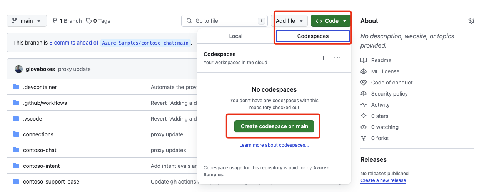

# Event access to Azure AI resources

You are following these instructions because you are participating in an event where the Azure AI resources for the workshop are provided for you. In this case, you'll be given an Azure AI Proxy Endpoint and a time bound API Key to access the Azure AI resources.

You will perform the follow steps:

1. Set up the workshop environment on your own computer or with GitHub Codespaces.
1. Create the Prompt Flow connections.
1. Proceed to the workshop.

## Azure Resources backing the workshop

The Azure AI resources for the workshop are provided by the Azure AI Proxy Endpoint. The Azure AI Proxy Endpoint provides access to the following Azure AI resources:

- [Azure AI Search](https://azure.microsoft.com/products/ai-services/ai-search/). The Azure AI Search connection provides access to the `contoso-products` search index.
- [Azure OpenAI](https://azure.microsoft.com/products/ai-services/openai-service). The Azure OpenAI connection provides access to the GPT-3.5-turbo, GPT-4 large, and embedding models.

## Set up the workshop environment

You can run the workshop on your own computer or with GitHub Codespaces.

### Run the workshop on your own computer

To run the workshop on your own computer, complete the following steps:

1. Install the following:
    - On Windows install [Python](https://www.python.org/downloads/), skip for macOS and Linux as Python is pre-installed.
    - [Visual Studio Code](https://code.visualstudio.com/)
    - [Python VS Code Extension](https://marketplace.visualstudio.com/items?itemName=ms-python.python)

1. From the command line, navigate to your preferred folder for the workshop.
1. Clone the Contoso Chat Proxy repository from GitHub:

    ```shell
    git clone https://github.com/gloveboxes/contoso-chat-proxy.git
    ```

1. Navigate to the `contoso-chat-proxy` folder.
1. Create a Python virtual environment:

    ```shell
    python -m venv .venv
    ```

1. Activate the virtual environment:

    On Windows:

    ```shell
    .venv/Scripts/activate
    ```

    On macOS and Linux:

    ```shell
    source .venv/bin/activate
    ```

1. Install the required Python packages:

    ```shell
    pip install -r requirements.txt
    ```

1. Open the `contoso-chat-proxy` folder in Visual Studio Code.

    ```shell
    code .
    ```

### Run the workshop with GitHub Codespaces

To run the workshop with GitHub Codespaces, complete the following steps:

1. Fork the [Contoso Chat Proxy](https://github.com/gloveboxes/contoso-chat-proxy) repository to your GitHub account.

    

1. Open the forked repository in GitHub Codespaces. In the forked repository, select `Code`, then the `Codespaces` tab, and then select `Create codespace on main`. The GitHub Codespaces environment will be created for you. It will take approximately 5 minutes to create the environment.

    <!--  -->

    !!! warning
        Be sure to stop the Codespace when you are done to avoid incurring charges.

## Grounding data for the workshop

There are two data sources for the workshop:

1. Product information from Azure AI Search. This data is accessed via the Azure AI Proxy Endpoint. The data was loaded into Azure AI Search from the `data/product_info` folder using the `create-azure-search.ipynb` notebook.
1. Customer order history data is loaded from the `data/customer_info` folder into a Python Pandas DataFrame. The data is used to create a personalized shopping experience for the customer. In production, this data would be accessed from a database such as [Cosmos DB](https://learn.microsoft.com/azure/cosmos-db/).

## Create the Prompt Flow connections

The following connections are created:

- **aoai-connection**: This connection is used to access Azure OpenAI embedding, gpt-35-turbo and gpt-4 large language models (LLMs).
- **contoso-search**: This connection is used to access the Azure AI Search service and `contoso-products` search index.

Create the Prompt Flow connections:

1. From VS Code, update the `.env.proxy` file with the Azure AI Proxy Endpoint and API Key provided to you.

1. Configure the Prompt Flow connections:

    - Open the `connections` folder, then open the `proxy-create-connections.ipynb` notebook.
    - You will be prompted to install the Jupyter extension, select **Install**.
    - Select `Run All` in the notebook to create the connections.

## Proceed to the workshop

Proceed to the [Workshop](workshop.md) section.
