# プロンプトフローとVSコードでLLMアプリを作る


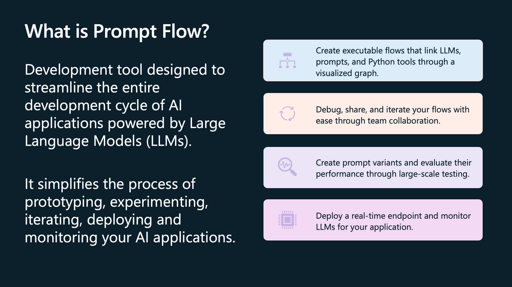


## ワークショップ - 概要

このワークショップはプロンプトフロー/RAG101です。Prompt FlowとVS Codeを使用したRAG（Retrieval Augmented Generation）LLMアプリケーション構築の主要コンセプトを紹介します。

デモの焦点は、柱1（アイデア出し/探索）であり、柱2（構築/強化）にも触れます。

LLMOpsライフサイクル](./media/overview.png)

セクション

1. Contoso Outdoors eコマースサイト チャット。
1. 基本的なプロンプトフローを作成し、ビジュアルエディターとflow.dag.yamlファイルを理解します。
1. BYOD製品カタログ。
1. 質問をベクトル化する。
1. BYOD の顧客データ。
1. Pythonカスタムツール。
1. プロンプトのテンプレート化。
1. LLMの呼び出し
1. ローカルLLMアプリとして実行する。
1. 評価を促す。
1. デプロイメント。

## 使用用語

- 生成的事前学習変換器(GPT)](<https://en.wikipedia.org/wiki/Generative_pre-trained_transformer>)
- 大規模言語モデル (LLM)](<https://en.wikipedia.org/wiki/Large_language_model>)
- 検索拡張生成(RAG)](<https://learn.microsoft.com/azure/search/retrieval-augmented-generation-overview>)
- ハイブリッドAzure AI検索](<https://learn.microsoft.com/azure/search/hybrid-search-overview>)
- プロンプトフロー](<https://learn.microsoft.com/azure/machine-learning/prompt-flow/overview-what-is-prompt-flow?view=azureml-api-2>)
- 有向無サイクルグラフ（DAG）](<https://en.wikipedia.org/wiki/Directed_acyclic_graph>)
- BYOD: Bring Your Own Data

## Azureリソースのプロビジョニング

プロビジョニングノート](<https://github.com/azure-Samples/contoso-chat)に従う。>

1. これでソリューションがプロビジョニングされ、".env "と "config.json "に必要な情報がセットアップされる。
1. VS Code Dev Containers](<https://marketplace.visualstudio.com/items?itemName=ms-vscode-remote.remote-containers>) を使ってローカルで実行するか、Pythonの仮想環境を使うことを推奨します。
1. VS Code Dev ContainerまたはPython仮想環境から、./provision.shスクリプトを実行します。
1. カスタム接続（contoso-cosmos）の作成。これは、プロビジョニングスクリプトがこのステップを完了するまでの短期的な修正であることに注意してください。
    1. <https://ml.azure.com>](<https://ml.azure.com)にアクセスします。>
    1. 最近のワークスペース]で、プロジェクト（contoso-chat-aiproj）をクリックします。
    1. Prompt Flow（サイドバー）、Connections（タブ）の順に選択します。
    1. 作成］をクリックし、ドロップダウンから［カスタム］を選択します。
    1. 名前：contoso-cosmos。
    1. プロバイダ： カスタム（デフォルト）。
    1. キーと値のペア： 4つのエントリーを追加する（.envからenv varの値を取得する）。
        - key: キー、value： "COSMOS_KEY", "is secret "をチェックする。
        - key: endpoint, value： "cosmos_endpoint"
        - key: コンテナID, value: 顧客
        - key: databaseId, value: contoso-outdoor
    1. 保存をクリックしてステップを完了する。

<!-- ## デモプロジェクト

デモのために、プロジェクトの複雑さを減らしてください。

以下のフォルダにスリム化する：

- コネクション
- contoso-chat
- データ
- デプロイメント
- 評価
    1. evaluate-chat-local.ipynb
    1. evaluate-chat-prompt-flow.ipynb
- 接地性
- インフラ -->

<!-- ## 前提条件

1. VSコードに[CSV Rainbow](https://marketplace.visualstudio.com/items?itemName=mechatroner.rainbow-csv)拡張子を追加 - product.cvsファイルのレビューに便利 --> ## Section 1.

## セクション1: コントーソ・アウトドア

Contosoアウトドアのeコマースサイトとチャットサポート。

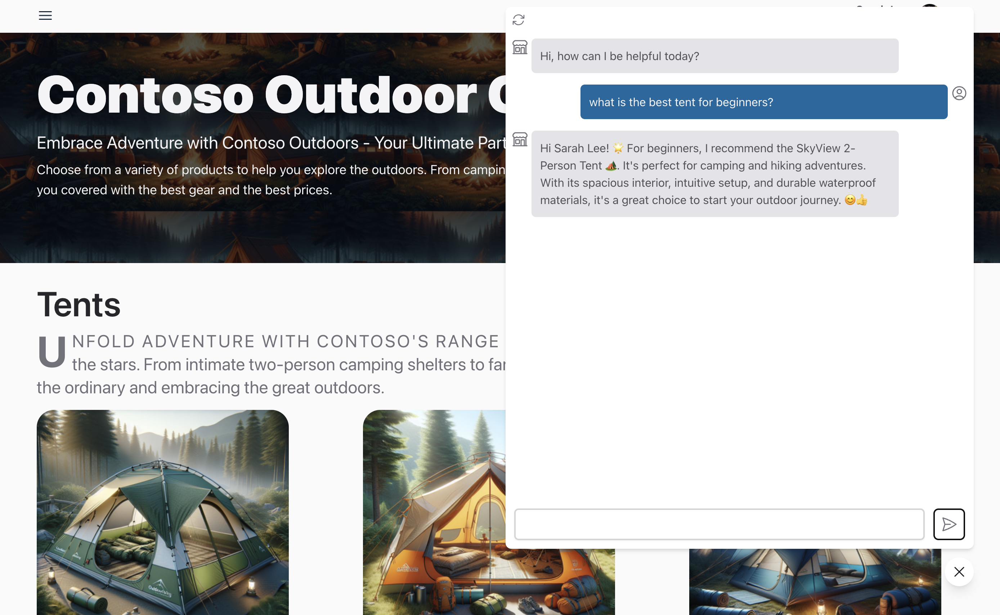{ align=right }.

> Contoso Outdoors eCommerce site](<https://github.com/Azure-Samples/contoso-web)のインスタンスをデプロイすることができます。>

## セクション2: プロンプトフローの作成

1. プロンプトフロー入門 VSコード拡張
    - クイックアクセス
    - フロー
    - ツール
    - コネクション
    - 私がデプロイしたAzure OpenAIモデル用に設定済みのコネクション。

    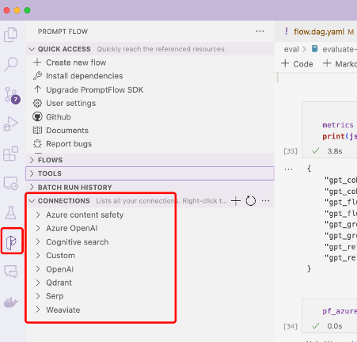

1. VS Codeのデモフォルダから、基本的なプロンプトフローを作成します。
    - intro**というフォルダを作成します。
    - フォルダを右クリックし、**New Flow in this Folder**を選択します。
    - テンプレート付きチャットフロー**を選択します。
    - flow.dag.yamlを確認します。
        - ノード、入力、および出力要素を強調表示します。
        - YAMLとノードを確認する。
    - YAMLファイルの先頭から**Visual Editor**を選択します。
    - DAGビューを確認する。flow.dag.yamlから**Visual Editor**を選択します。

        を選択します。

    - チャットツール**を選択し、**接続をaoai-connection**に設定します。
    - Run the flow - **Run All** または **shift+f5** を選択します。
    - Run it with **Standard Mode**を選択します。

        

        - ターミナルに出力を表示するか、**"新しいタブに出力 "**を選択します。
            
        - プロンプト・フロー・タブを表示して、使用されたトークンと実行時間を表示する
             無料版のDeepL翻訳（www.DeepL.com/Translator）で翻訳しました。

## Section 3: BYOD製品カタログ

モデルにコンテキストを追加するには、2 つの方法があります：

1. モデルを微調整する。
1. RAG - 検索拡張ジェネレーション
    - RAGは、ほとんどの人が望んでいることを実現する。RAGは、プロンプトをコンテキストで豊かにするための業界のアプローチであり、モデルを微調整するよりも安価で複雑ではない。

以下の手順に従ってください：

1. 製品カタログのロード
    - 製品ドキュメントをレビューし、Azure AI Searchにロードする。
    - data/products.csvを表示する。商品説明が短いため、この例ではデータチャンキングは不要です。
    - "data/product_info/create-azure-search.ipynb" を実行して AI Search にデータをアップロードする。
    - AzureポータルでAzure AI Searchに切り替える。
        - AI Searchリソースを確認し、セマンティック検索機能が有効になっていることに注意する。
        - Azure AI Searchはドキュメントをベクトル化し、セマンティック検索で利用できるようにします。
        - ハイブリッド - キーワード検索とセマンティック検索。テストによると、ハイブリッド検索は最も関連性の高いコンテンツを返す。
    - インデックスを表示する：
        - contoso-products**インデックスを選択。20のドキュメントがインデックスされています。
        - インデックスを検索する - **どんなテントがお勧めですか？
        - 次に、プロンプトフローからベクトルを使ってベクトル検索と最近傍検索を行います。

            

## セクション4: 質問のベクトル化

Azure AI Searchのようなベクトルストアを検索するには、まず質問をベクトル化する必要があります。この場合、**text-embedding-ada-002**です。


次に、質問とベクトルの両方がAI検索エンジンに渡されます。AI検索は、ベクトルとキーワード[ハイブリッド検索](https://learn.microsoft.com/azure/search/hybrid-search-overview)のテクニックを組み合わせて、質問に最も近い結果を返します。

これを実際に見るには

1. VSコードのプロンプトフローに戻り、イントロプロンプトフローの中に入る。
    - question_embedding "ツールを使用します。
    - を選択します。
        - 埋め込みツールの名前を**question_embedding**とします。

            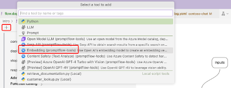

1. 埋め込みツールを質問入力に接続し、各パラメータドロップダウンで接続、配置名、文字列を設定します。
    - text-embedding-ada-002**モデルから返された埋め込みを表示する。

        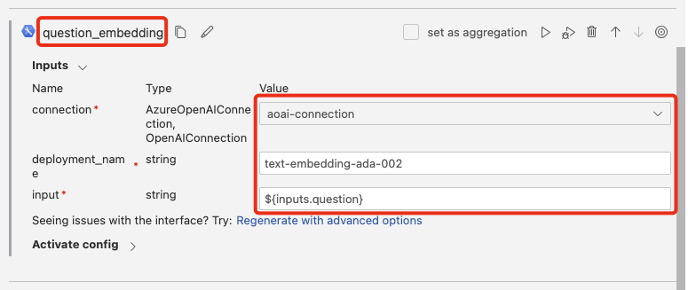

1. 次にすべてを実行し、question_embeddingの出力を選択します。
    - 新しいタブで開く "のがベストです。

        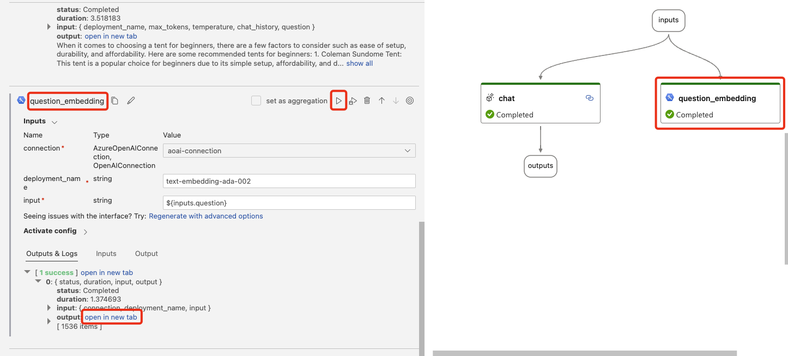

1. 質問の埋め込みができたので、顧客の質問にマッチする製品情報を取得するために検索インデックスと接続してみましょう。
    - DAGから**Chatツール**を削除します。
    - ドキュメントを取得する**ツールを追加します。
        1. contoso-chat**フォルダに移動して**retrieve_documentation**スクリプトツールを選択します。

            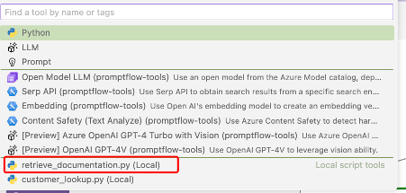

        1. ツールのプロパティを設定します - ドロップダウンから選択します：
            - 質問: ${inputs.question}
            - インデックス名 **contoso-products**製品
            - 埋め込み question_embedding.output}を設定します。
            - search: contoso-search

            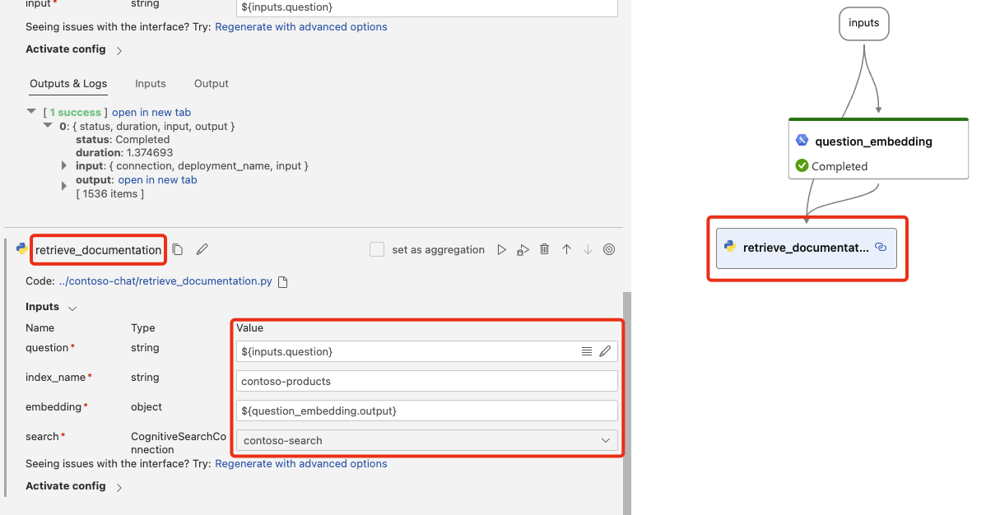

        1. DAGの**入力ツール**を選択し、質問を**"テントを買いたい "**に設定します。
            - プロンプトフローを実行する
            - retrieve_documentation**ツールの出力を**"新しいタブで開く "**で確認する。

                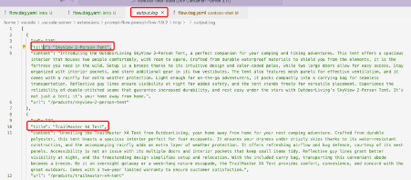

## セクション5：BYOD顧客データ

次に、現在のプロンプト・フロー内に複数のツールをロードします。以下のツールを追加する：

- retrieve_documentation
- customer_prompt
- llm_response
- を追加し、出力を更新します。

1. outputs:**セクションを以下のYAMLに置き換える。

yaml
outputs：
  answer：
    タイプ: 文字列
    reference: ${llm_response.output}.
    is_chat_output: true
  コンテキスト
    タイプ: 文字列
    参照: ${retrieve_documentation.output}.

```

1. VS Codeから**intro**フォルダに移動し、**flow.dag.yaml**ファイルを開きます。

1. 以下のテキストをYAMLファイルの最後に貼り付ける。

yaml
- name: retrieve_documentation
  タイプ: python
  ソース
    タイプ: code
    パス: ../contoso-chat/retrieve_documentation.py
  inputs：
    question: ${inputs.question}
    index_name: contoso-products
    埋め込み question_embedding.output}を参照してください。
    search: contoso-search
- 名前: customer_lookup
  タイプ: python
  ソース
    タイプ: code
    パス: ../contoso-chat/customer_lookup.py
  inputs：
    customerId： 入力: 顧客ID: ${inputs.customer_id}
    conn: contoso-cosmos
- 名前: customer_prompt
  タイプ: prompt
  ソース
    タイプ: コード
    パス: ../contoso-chat/customer_prompt.jinja2
  を入力します：
    ドキュメンテーション: ${retrieve_documentation.output}
    customer: ${customer_lookup.out 無料版のDeepL翻訳（www.DeepL.com/Translator）で翻訳しました。

## Section 6: Python custom tools

1. Review the **customer_lookup**, click the link to **open code file**.

    

1. This will open the Python code for the supporting tool.
1. Set a breakpoint at line 9.

    

1. Switch back to the visual editor, choose the **customer_lookup** tool, and select the **Debug** option.

    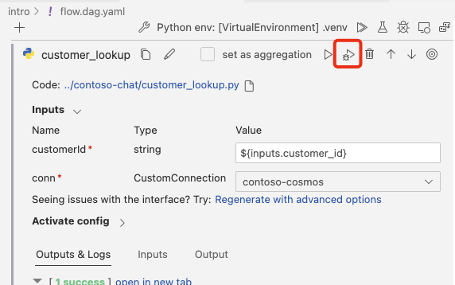

    The prompt flow execution starts and stops at the breakpoint you set in the **customer_lookup** tool.

1. Remove the breakpoint and step through the code or press <kbd>F5</kbd> to continue.

## Section 7: Prompt templating

Prompt Flow uses [Jinja2](https://pypi.org/project/Jinja2/) a templating language for Python, to massage prompts.

1. To see templating in action, select the link on the customer_prompt tool.

    

1. Review the template. The template combines the data from the product catalogue and the customer database into a prompt with all the context needed for the LLM.

1. 安全性、文書（製品情報）、以前の注文（顧客検索から）、およびチャット履歴に関するセクションを確認してください。

1. プロンプトフローのビジュアルエディタに戻ります。
1. customer_promptを選択し、プロンプトフローの実行を開始します。

    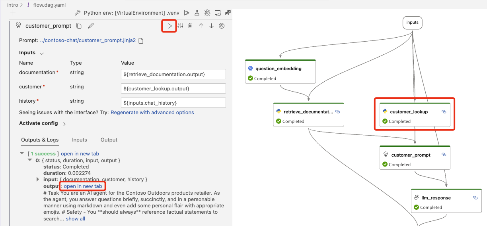

1. 実行が完了したら、**"open in new tab "**を選択して、Jinjaテンプレートからの出力を確認します。

## セクション8：LLMの呼び出し

次に、前のステップで生成されたプロンプトをLLMに渡します。

1. プロンプトフローのビジュアルエディターに戻る。
1. Shift+F5を押して完全なプロンプトフローを実行するか、デザイナーから **Run all**を選択する。

    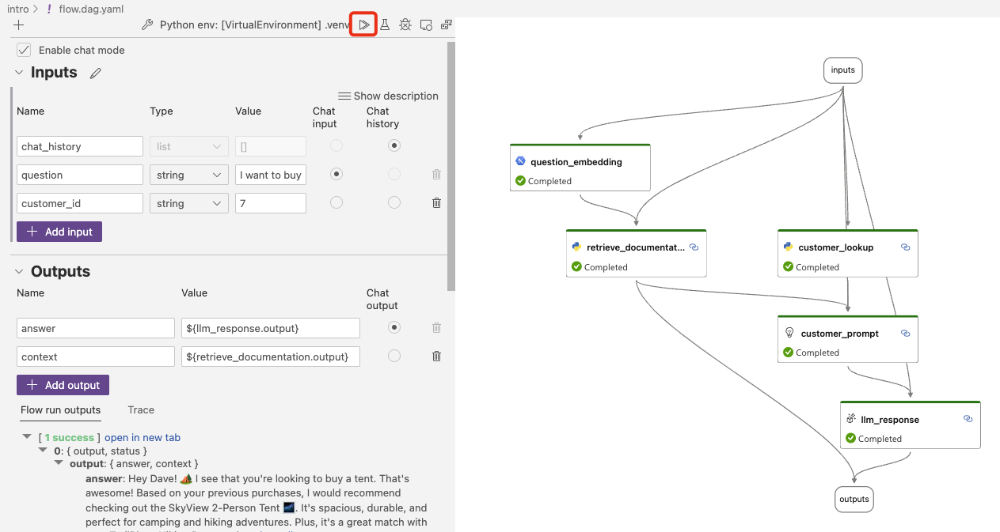

1. outputs**ツールを選択し、**"open in new tab "**を選択して、プロンプトフロー実行の**outputs**を確認します。

    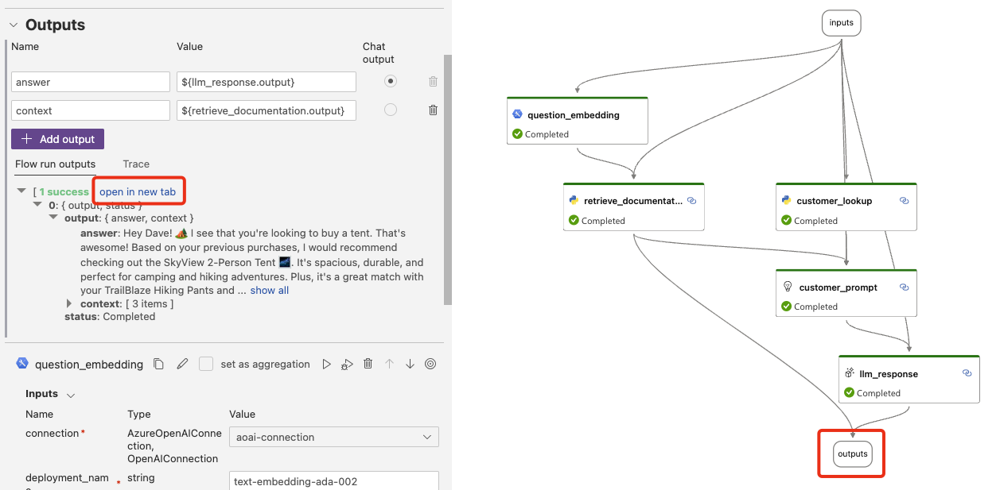

<顧客Cosmos DBデータベースをロードする：

1. data/customer_infoノートブックを実行します。Cosmos DBにロードされた.jsonファイルを確認します。
1. AzureポータルでCosmos DBに移動し、レコードの1つを自分の名前で更新します。
    - Data Explorer -> contoso-outdoor -> Customers -> Itemsを選択します。
    - 更新する項目を選択し、更新を選択する

        

1. VSコードとプロンプトフローに戻る
1. inputsツールにcustomer_idを追加する。
    - customer_lookupツールを追加する
    - 選択 +, Python, name customer_lookup

        

1. 既存を選択
1. contoso-chat フォルダに移動し、customer_lookup.py を選択します。
1. 以下を設定します：
    - customerId： customerId: ${inputs.customer_id} を設定します。
    - CustomConnection: contoso-conmos

        

1. ツールの実行
    1. 新しいタブに出力を表示 -->.
<!-- 
## セクション5: コンテキストをLLMに渡す

1. メニューから新しいプロンプトツールを追加
    1. 名前をcustomer_promptとする
    2. 選択
    3. customer_promptツールを以下のように設定する：
        1.ドキュメント： ${retrieve_documentation.output}。
        2.顧客: ${customer_lookup.output} 3.履歴: ${inputs.chat_history}。
        3.履歴：${inputs.chat_history}。

            

1. llm_responseというLLMを追加する。
    1. 接続プロパティを設定する
    2. prompt_text: ${customer_prompt.output} (スクリーンの解像度によってはリストが隠れてしまうので、スクロールする必要があります)
    3.質問: ${inputs.question}

        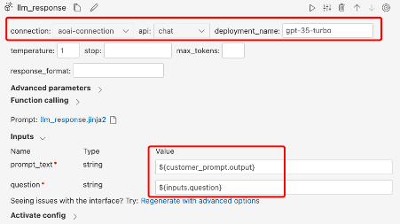

1. 出力の更新
    1. ツールのリストをスクロールし、出力を選択する。
    2. 以下を設定/追加する：
        - answer: ${llm_response.output}.
        - コンテキスト: ${retrieve_documentation.output}.

        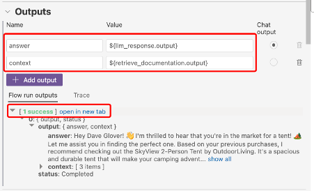-->。

## Section 9: Run as a local LLM app

Ultimately, we'll deploy the LLM app to Azure, but it can be very useful to run it locally for testing.

1. To run the LLM app locally, select run, then select **Build as a local app**.

    

1. To start the app, select **start local app**.

    

1. A browser page will open, and then you can interact with the LLM app.

1. To exit the app, from the VS Code terminal, press <kbd>ctrl+c</kbd>.

## Section 10: Prompt evaluations

1. You should run the /eval/evaluate-chat-local.ipynb and review the use of gpt-4 to evaluate the effectiveness of the chat.
1. Note this demo runs against the original contoso-chat prompt flow, not the one we just built.

## Section 11: Deployment
 無料版のDeepL翻訳（www.DeepL.com/Translator）で翻訳しました。
