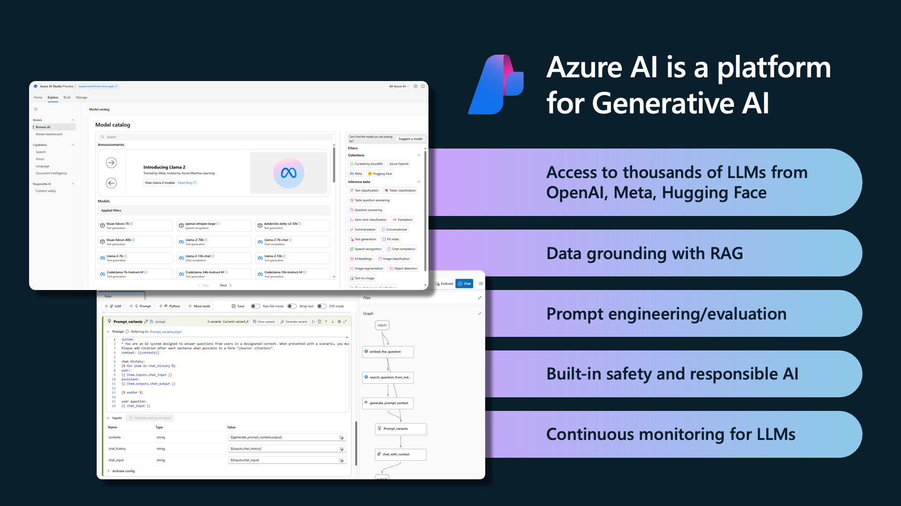
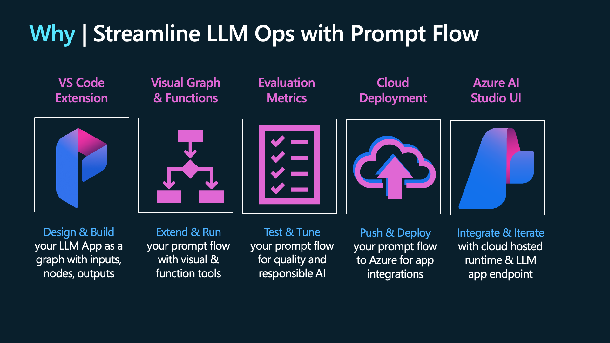
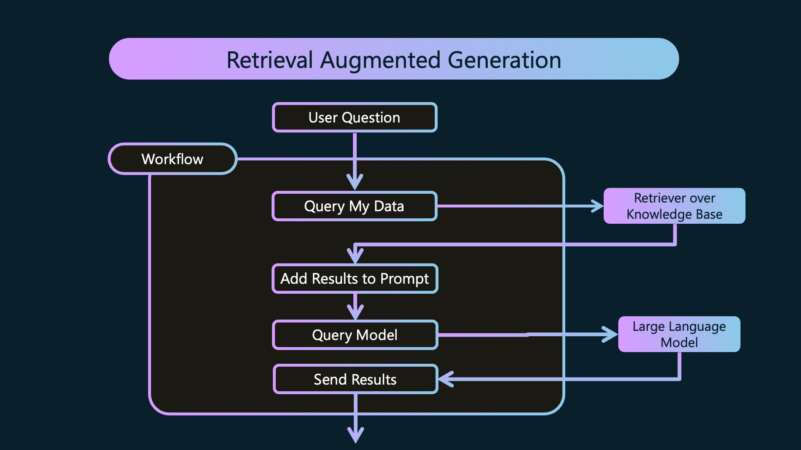
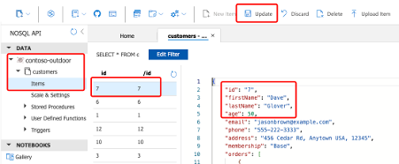

# Production LLM apps with Azure AI and Prompt Flow

## Slides

The PowerPoint slides with speaker notes are available for download

1. [English](https://view.officeapps.live.com/op/view.aspx?src=https%3A%2F%2Fraw.githubusercontent.com%2Fgloveboxes%2Fprompt_flow_demo_docs%2Fmain%2Fdocs%2Fresources%2FBuild%2520your%2520RAG%2520Application%2520with%2520Prompt%2520flow%2520in%2520Azure%2520AI%2520Studio%2520-%2520dglover.pptx)
1. [Japanese](https://view.officeapps.live.com/op/view.aspx?src=https%3A%2F%2Fraw.githubusercontent.com%2Fgloveboxes%2Fprompt_flow_demo_docs%2Fmain%2Fdocs%2Fresources%2FBRK408JP_jp-BRK408AU_Build your RAG Application with Prompt flow in Azure AI Studio - dglover.pptx)

## Workshop introduction

This workshop is a Prompt Flow/RAG 101. An introduction to the key concepts of building a Retrieval Augmented Generation (RAG) Large Language Model (LLM) application with Azure AI, Prompt Flow, and VS Code.

There are two approaches to grounding your LLM apps with your data. You can either fine tune a model or use the RAG pattern.

1. Fine tuning a model is complex and expensive.
1. RAG - Retrieval Augmented Generation. RAG is an industry approach to enriching a prompt with context, it is cheaper, less complex than fine tuning a model, easier to leverage existing IT investments.

Grounding is the process of connecting your Large Language Model (LLM) to your data. It is a critical step to ensure that the model's responses are relevant and aligned with current knowledge. Grounding also helps prevent the model from generating misleading or inaccurate information.

## Rag pattern use cases

1. **Information Retrieval:** Enhancing search engines to provide more accurate and context-aware results.
1. **Conversational Agents:** Improving chatbots or virtual assistants for more natural and contextually relevant interactions.
1. **Content Generation:** Creating high-quality articles, summaries, or creative writing with improved coherence.
1. **Language Translation:** Enhancing language translation services for more nuanced and context-aware translations.
1. **Code Generation:** Assisting developers in generating code snippets or completing code with better contextual understanding.
1. **Customer Support:** Improving automated responses in customer service applications for more effective and empathetic communication.
1. **Education:** Facilitating personalized learning experiences by providing tailored explanations and resources based on user queries.

## Introduction to AI Studio

AI Studio is a generative AI development hub that provides access to thousands of language models from OpenAI, Meta, Hugging Face, and more.

1. It offers data grounding with retrieval augmented generation (RAG), prompt engineering and evaluation, built-in safety, and continuous monitoring for language models.
1. With Azure AI Studio, you can quickly and securely ground models on your structured, unstructured, and real-time data.
1. It is a powerful tool for professional software developers who want to create generative AI applications.

### What is Prompt Flow

Azure Prompt Flow simplifies the process of prototyping, experimenting, and deploying AI applications powered by Large Language Models (LLMs). It is designed for developers, data scientists, researchers, or hobbyists who want to create LLM-based applications. With Azure Prompt Flow, you can create and compare multiple prompt variants, evaluate their performance, and debug your flows with ease.

### VS Code code first support

There is now a [Prompt Flow extension for VS Code](https://marketplace.visualstudio.com/items?itemName=prompt-flow.prompt-flow) to build your LLM apps, this extension makes it easy to use version control systems like `git` as well as collaborating with others.

<!-- ### Why streamlining LLM Ops with Prompt Flow

 -->

### Prompt Flow and LangChain

A question you might be asking is what is the difference between Prompt Flow and LangChain. Prompt Flow is an end-to-end solution for prototyping, evaluation, deployment to production, and monitoring. LangChain is a library that you could use in your Prompt Flows.

### The LLM Lifecycle

The LLM lifecycle is a complex and iterative process that involves ideation, development, deployment, and management. The process is unified by four overarching loops, with three primary loops: Ideation & Exploration, Building & Augmenting, and Operationalizing. Developers experiment with LLM prompts to understand how they engage with data, refine LLMs to align them with specific enterprise needs, and ensure LLMs are easily integrated into systems and operate safely. The Management loop focuses on governance, security, and compliance. Azure AI simplifies the complexities of the Enterprise LLM Lifecycle.

## Workshop - Overview

The focus of the workshop is on pillar 1 (Ideation/exploring) and touches upon pillar 2 (Building/augmenting).

### Solution overview

The solution is a chatbot that helps customers find the right product for their needs. The chatbot is built with Prompt Flow and uses a RAG pattern to ground the LLM prompt with product information and customer order history. A user can ask a question like `what tents can you recommend for beginners?` and the chatbot will respond with a product recommendation based on the customer's order history and the product catalog.

The Contoso outdoor eCommerce site calls the Prompt Flow chatbot to provide product recommendations to customers.

> You can deploy your own instance of the [Contoso Outdoors eCommerce site](https://github.com/Azure-Samples/contoso-web).

### Terms used

- [Generative pre-trained transformer (GPT)](https://en.wikipedia.org/wiki/Generative_pre-trained_transformer)
- [Large Language Model (LLM)](https://en.wikipedia.org/wiki/Large_language_model)
- [Retrieval Augmented Generation (RAG)](https://learn.microsoft.com/azure/search/retrieval-augmented-generation-overview)
- [Hybrid Azure AI Search](https://learn.microsoft.com/azure/search/hybrid-search-overview)
- [Prompt Flow](https://learn.microsoft.com/azure/machine-learning/prompt-flow/overview-what-is-prompt-flow?view=azureml-api-2)
- [Directed acyclic graph (DAG)](https://en.wikipedia.org/wiki/Directed_acyclic_graph)
- BYOD: Bring Your Own Data

### Requirements

You require an Azure Subscription. If you don't have an Azure subscriptions, you can create a [free subscription](https://azure.microsoft.com/en-us/free/free-account-faq).

## Step 1: Provisioning Azure resources

In this section you'll set up the Azure resources required for the workshop.

1. Clone the [contoso-chat](https://github.com/azure-Samples/contoso-chat) repo.
1. From the VS Code Dev Container or the virtual Python environment, run the `./provision.sh` script.
1. After the provisioning script completes, follow the instructions raised in this [issue](https://github.com/Azure-Samples/contoso-chat/issues/52).

## Step 2: Load grounding data

The solutions uses two data sources to ground the LLM prompt. The first is an Azure AI Search index that contains product information. The second is a Cosmos DB database that contains customer information.

### Load the product catalog

In this step you'll learn how to load product data into [Azure AI Search](https://learn.microsoft.com/en-us/azure/search/). The product database will be used to ground the LLM prompt with product information.

Azure AI Search is a hybrid index service with support for keyword and semantic vector search. When data the is loaded into Azure AI Search, a keyword index is built for each product, and an embedding is generated for each product and is stored in a vector index.

Architecturally, a search service sits between the external data stores that contain your un-indexed data, and your client app that sends query requests to a search index and handles the response.

Follow these steps:

1. Ensure you have the **contoso-chat** repo open in VS Code.
1. Load the Product catalog
    - Open the `data/product_info/products.csv` file and review the contents.
    - Run the `data/product_info/create-azure-search.ipynb` Jupyter Notebook. The notebook will store product data and generated product description embeddings in Azure AI Search.
    - Switch to Azure AI Search in the Azure Portal
    - Review the AI Search resource and note that the semantic search feature is enabled.
    - Show the indexes:
        - Select the `contoso-products` index. There are 20 documents indexed.
        - Search the index - `what tents can you recommend?`. Azure AI Search will use the keyword index to return the product catalog results that most closely match the question.
        - Review the results and note the vector from the embedding is returned with each result.
        - The Prompt Flow will use the index to ground the LLM prompt.

            

### Load the customer database

In this step you'll learn how to load customer data into [Cosmos DB](https://docs.microsoft.com/azure/cosmos-db/introduction). The customer data will be used to ground the LLM prompt with customer order history.

1. Run the `/data/customer_info/create-cosmos-db.ipynb` Jupyter Notebook to load the customer data into Cosmos DB.
1. Navigate to Cosmos DB in Azure Portal and update one of the records with your name.
    - Select Data Explorer -> contoso-outdoor -> Customers -> Items.
    - Pick and item to update, the select Update.

        

