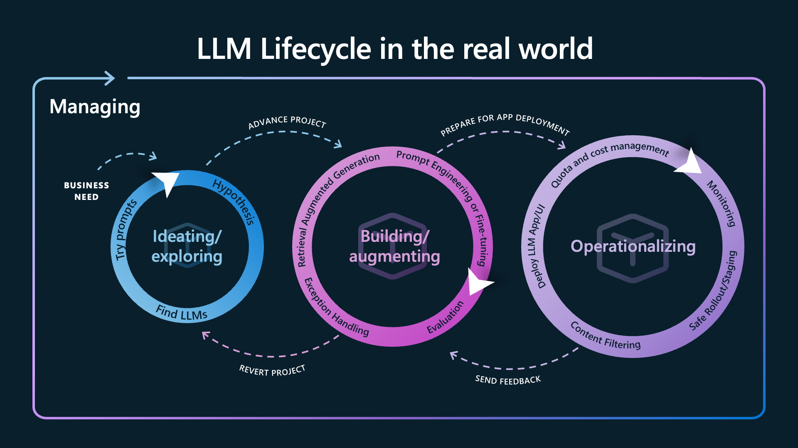

# Production LLM apps with Azure AI and Prompt Flow

## Slides

The companion PowerPoint slides with speaker notes are available for download

1. [English](https://view.officeapps.live.com/op/view.aspx?src=https%3A%2F%2Fraw.githubusercontent.com%2Fgloveboxes%2Fprompt_flow_demo_docs%2Fmain%2Fdocs%2Fresources%2FBuild%2520your%2520RAG%2520Application%2520with%2520Prompt%2520flow%2520in%2520Azure%2520AI%2520Studio%2520-%2520dglover.pptx)
1. [Japanese](https://view.officeapps.live.com/op/view.aspx?src=https%3A%2F%2Fraw.githubusercontent.com%2Fgloveboxes%2Fprompt_flow_demo_docs%2Fmain%2Fdocs%2Fresources%2FBRK408JP_jp-BRK408AU_Build your RAG Application with Prompt flow in Azure AI Studio - dglover.pptx)

## Workshop introduction

This workshop is a Prompt Flow/RAG 101. An introduction to the key concepts of building a Retrieval Augmented Generation (RAG) Large Language Model (LLM) application with Azure AI, Prompt Flow, and VS Code.

There are two approaches to grounding your LLM apps with your data. You can either fine tune a model or use the RAG pattern.

1. Fine tuning a model is complex and expensive, though there are some use cases where it is the best approach.
1. RAG - Retrieval Augmented Generation. RAG is an industry approach to enriching a prompt with context, it is cheaper, less complex than fine tuning a model, easier to use existing IT investments. This workshop focuses on the RAG pattern.

Grounding connects your Large Language Model (LLM) to your data. It is a critical step to ensure that the model's responses are relevant and aligned with current knowledge. Grounding also helps prevent the model from generating misleading or inaccurate information.

## Rag pattern use cases

1. **Information Retrieval:** Enhancing search engines to provide more accurate and context-aware results.
1. **Conversational Agents:** Improving chatbots or virtual assistants for more natural and contextually relevant interactions.
1. **Content Generation:** Creating high-quality articles, summaries, or creative writing with improved coherence.
1. **Language Translation:** Enhancing language translation services for more nuanced and context-aware translations.
1. **Code Generation:** Helping developers in generating code snippets or completing code with better contextual understanding.
1. **Customer Support:** Improving automated responses in customer service applications for more effective and empathetic communication.
1. **Education:** Facilitating personalized learning experiences by providing tailored explanations and resources based on user queries.

## Introduction to AI Studio

AI Studio is a generative AI development hub that provides access to thousands of language models from OpenAI, Meta, Hugging Face, and more.

1. It offers data grounding with retrieval augmented generation (RAG), prompt engineering and evaluation, built-in safety, and continuous monitoring for language models.
1. With Azure AI Studio, you can quickly and securely ground models on your structured, unstructured, and real-time data.
1. It is a powerful tool for professional software developers who want to create generative AI applications.

### What is Prompt Flow

There are several approaches to building RAG applications, there are code centric approaches like LangChain, Semantic Kernel, and the OpenAI Assistant API and low code/no code approaches.

Prompt Flow is a low code/no code approach to building RAG applications.

Azure Prompt Flow simplifies prototyping, experimenting, and deploying AI applications powered by Large Language Models (LLMs). Prompt Flow is designed for developers, data scientists, researchers, or hobbyists who want to create LLM-based applications. With Azure Prompt Flow, you can create and compare multiple prompt variants, evaluate their performance, and debug your flows with ease.

### VS Code code first support

There is now a [Prompt Flow extension for VS Code](https://marketplace.visualstudio.com/items?itemName=prompt-flow.prompt-flow) to build your LLM apps; this extension makes it easy to use version control systems like `git` as well as collaborating with others.

<!-- ### Why streamlining LLM Ops with Prompt Flow

 -->

### Prompt Flow and LangChain

A question you might be ask is what is the difference between Prompt Flow and LangChain. Prompt Flow is an end-to-end solution for prototyping, evaluation, deployment to production, and monitoring. LangChain is a library that you could use in your Prompt Flows.

### The LLM Lifecycle

The LLM lifecycle is a complex and iterative process that involves ideation, development, deployment, and management. The process is unified by four overarching loops, with three primary loops: Ideation & Exploration, Building & Augmenting, and Operationalizing. Developers experiment with LLM prompts to understand how they engage with data, refine LLMs to align them with specific enterprise needs, and ensure LLMs are easily integrated into systems and operate safely. The Management loop focuses on governance, security, and compliance. Azure AI simplifies the complexities of the Enterprise LLM Lifecycle.

## Workshop - Overview

The focus of the workshop is on pillar 1 (Ideation/exploring) and touches upon pillar 2 (Building/augmenting).

### Solution overview

The solution is a chatbot that helps customers find the right product for their needs. The chatbot is built with Prompt Flow and uses a RAG pattern to ground the LLM prompt with product information and customer order history. A user can ask a question like `what tents can you recommend for beginners?` and the chatbot will respond with a product recommendation based on the customer's order history and the product catalog.

The Contoso outdoor eCommerce site calls the Prompt Flow endpoint deployed to Azure to provide product recommendations to customers.

> You can deploy your own instance of the [Contoso Outdoors eCommerce site](https://github.com/Azure-Samples/contoso-web).

### Terms used

- [Generative pre-trained transformer (GPT)](https://en.wikipedia.org/wiki/Generative_pre-trained_transformer)
- [Large Language Model (LLM)](https://en.wikipedia.org/wiki/Large_language_model)
- [Embedding](https://learn.microsoft.com/azure/ai-services/openai/concepts/understand-embeddings): An embedding is a type of vector that is generated by a machine learning model and has semantic meaning. In this workshop, we'll be using the **text-embedding-3-small** model which generates a 1 x 1536 dimensioned vector.
- [Retrieval Augmented Generation (RAG)](https://learn.microsoft.com/azure/search/retrieval-augmented-generation-overview)
- [Hybrid Azure AI Search](https://learn.microsoft.com/azure/search/hybrid-search-overview)
- [Prompt Flow](https://learn.microsoft.com/azure/machine-learning/prompt-flow/overview-what-is-prompt-flow?view=azureml-api-2)
- [Directed acyclic graph (DAG)](https://en.wikipedia.org/wiki/Directed_acyclic_graph)
- BYOD: Bring Your Own Data
