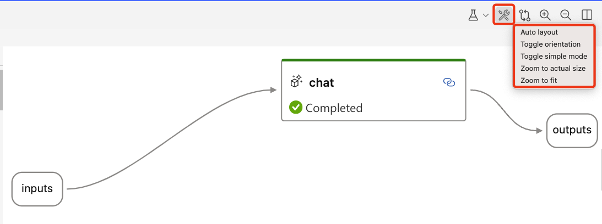
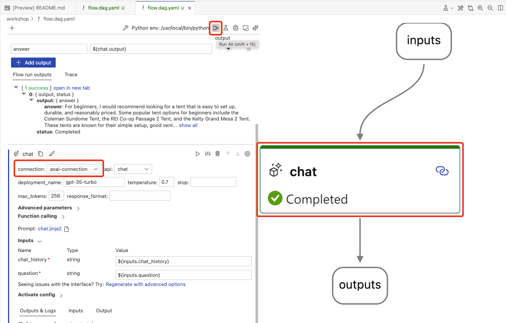
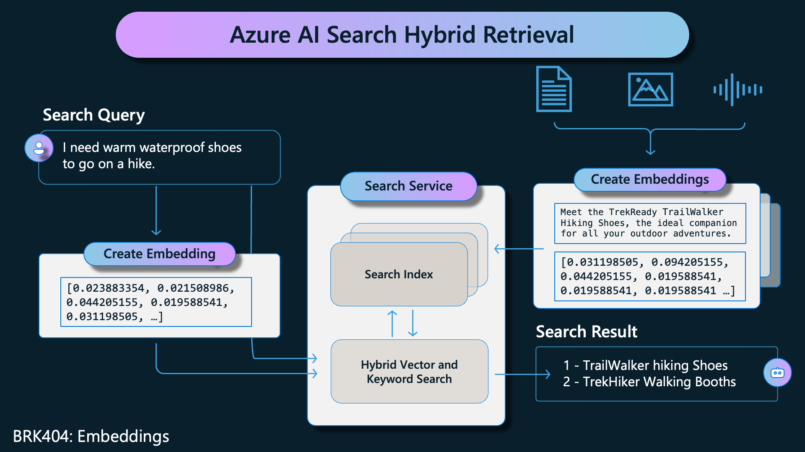

# Prompt Flow Workshop

This workshop demonstrates how to use Prompt Flow to create a chatbot that is grounded with product and customer information. You'll learn how to:

1. Create a Prompt Flow.
1. Create a RAG pattern (Retrieval, Augmentation, Generation) to ground the chatbot with context.
1. How to evaluate the chatbot performance.
1. How to test the chatbot locally.

## Create your first Prompt Flow

In this section you'll learn the basics of Prompt Flow with VS Code.

1. Select the Prompt Flow VS Code extension and review the following tabs: **QUICK ACCESS, FLOWS, TOOLS, BATCH RUN HISTORY, and CONNECTIONS**. Note, the connections were created in the previous section.

    

1. Create a new Prompt Flow by following these steps:
    1. From the VS Code **Activity Bar**, select the **Explorer** icon.
    1. Right-click the **workshop** folder.
    1. Select **New flow in this directory**.
    1. Select the **Chat flow with the template**.
    1. Finally, review the generated `flow.dag.yaml` file.

1. Select the **Visual editor** link at the top of the `flow.dag.yaml` file to open the visual editor.

    

1. Experiment with the **DAG Tools** to change the layout.

    

1. Set the Prompt Flow parameters:
    - Select the **inputs** tool in the visual editor, then set the **question** to `what tents can you recommend for beginners?`.
    - Select the **Chat** tool and set the **connection** to `aoai-connection`.

      !!! tip
          If you forget to set these parameters, the flow may not execute using the **Run All** button. Set the missing parameters and run the flow with the **Debug** option <kbd>F5</kbd>.

1. Run the flow by selecting **Run All** or <kbd>shift+F5</kbd>. This will execute the flow and will pass the question to the LLM. Note, the LLM will return a response that is **not** grounded with product or customer information.

    

1. Select **Run it with Standard Mode**.

1. When the flow completes, select **outputs** from the Visual editor and review the Prompt Flow tab to show tokens used and run duration.

    

1. Review the **Outputs & Logs** for the **outputs** tool. Select **open in new tab** to review the output from the LLM.

    

1. Switch back to the `flow.dag.yaml` file.

## Create a RAG pattern app

Next, we'll create a RAG pattern app that will ground the LLM prompt with product and customer information. The steps are as follows:

1. **Retrieve**, the R in RAG: Retrieve product and customer information.
1. **Augment**, the A in RAG: Augment the LLM prompt with product and customer information.
1. **Generate**, the G in RAG: Generate a response from the LLM.

## Step 1: Retrieve, the R in RAG

In this step there will be two retrievals that will be used to ground the LLM prompt with product information and customer order history.

1. Query the product catalog Azure AI Search service for product information
1. Query the customer Cosmos DB database for customer order history information.

### Retrieving product information

To retrieve product information, we'll use the Azure AI Search index that was created in the previous section. First, we'll generate an embedding for the question and perform a keyword and semantic search on the product index in Azure AI Search.

#### Generate an embedding

To search a vector store like Azure AI Search, we first need to create an embedding for the question. We do this by passing the question text to an embeddings model, in this case, **text-embedding-ada-002**.

#### What is an embedding

An embedding is a type of vector that is generated by a machine learning model and has semantic meaning. In this workshop we'll be using the **text-embedding-ada-002** model which generates a 1 x 1536 dimensioned vector.

#### Querying the product index

Next, both the question and vector are passed to the AI Search engine. AI Search will use a combination of vector and keyword [hybrid search](https://learn.microsoft.com/azure/search/hybrid-search-overview) techniques to return the product catalog results that most closely match the question.



### Retrieving data

Follow these steps to retrieve the product and customer information:

1. **Close the Visual editor tab to avoid issues with the next steps.**
1. From VS Code, navigate to the **workshop** folder and open the **flow.dag.yaml** file. The file contains the YAML representation of the Prompt Flow.
1. Replace the existing flow with the following YAML.

    ``` { .yaml .copy }
    $schema: https://azuremlschemas.azureedge.net/promptflow/latest/Flow.schema.json
    environment:
      python_requirements_txt: requirements.txt
    inputs:
      chat_history:
        type: list
        is_chat_history: true
        default: []
      question:
        type: string
        is_chat_input: true
        default: recommended tents for beginners
      customer_id:
        type: string
        default: "7"
    outputs:
      answer:
        type: string
        reference: ${customer_lookup.output}
        is_chat_output: true
      context:
        type: string
        reference: ${retrieve_documentation.output}
    nodes:
    - name: question_embedding
      type: python
      source:
        type: package
        tool: promptflow.tools.embedding.embedding
      inputs:
        connection: aoai-connection
        deployment_name: text-embedding-ada-002
        input: ${inputs.question}
    - name: retrieve_documentation
      type: python
      source:
        type: code
        path: ../contoso-chat/retrieve_documentation.py
      inputs:
        question: ${inputs.question}
        index_name: contoso-products
        embedding: ${question_embedding.output}
        search: contoso-search
    - name: customer_lookup
      type: python
      source:
        type: code
        path: ../contoso-chat/customer_lookup.py
      inputs:
        customerId: ${inputs.customer_id}
        conn: contoso-cosmos
    ```

### Custom tools

1. Select **Visual editor** from the top of the **flow.dag.yaml** file.

1. Review the **customer_lookup** custom tool, click the link to **open code file**.

    

1. Review the code for the **customer_lookup** tool. The tool performs a query on the Cosmos DB database to retrieve customer information.

1. Set a breakpoint at line 9.

    

1. Select **Debug** the **retrieve_documentation** tool. 
    - The prompt flow execution starts and stops at the breakpoint you set in the **retrieve_documentation** tool. 
    - Step through the code or press <kbd>F5</kbd> to continue.
    - Remove the breakpoint and step through the code or press <kbd>F5</kbd> to continue.

    

## Step 2: Augmentation, the A in RAG

In this step you'll learn how to augment the LLM prompt with product and customer information to create a prompt that is grounded with context.

1. **Close the Visual editor tab to avoid issues with the next steps.**
1. From VS Code, navigate to the `workshop` folder and open the **flow.dag.yaml** file. The file contains the YAML representation of the Prompt Flow.
1. Replace the existing flow with the following YAML.

    ``` { .yaml .copy }
    $schema: https://azuremlschemas.azureedge.net/promptflow/latest/Flow.schema.json
    environment:
      python_requirements_txt: requirements.txt
    inputs:
      chat_history:
        type: list
        is_chat_history: true
        default: []
      question:
        type: string
        is_chat_input: true
        default: recommended tents for beginners
      customer_id:
        type: string
        default: "7"
    outputs:
      answer:
        type: string
        reference: ${inputs.question}
        is_chat_output: true
      context:
        type: string
        reference: ${customer_prompt.output}
    nodes:
    - name: question_embedding
      type: python
      source:
        type: package
        tool: promptflow.tools.embedding.embedding
      inputs:
        connection: aoai-connection
        deployment_name: text-embedding-ada-002
        input: ${inputs.question}
    - name: retrieve_documentation
      type: python
      source:
        type: code
        path: ../contoso-chat/retrieve_documentation.py
      inputs:
        question: ${inputs.question}
        index_name: contoso-products
        embedding: ${question_embedding.output}
        search: contoso-search
    - name: customer_lookup
      type: python
      source:
        type: code
        path: ../contoso-chat/customer_lookup.py
      inputs:
        customerId: ${inputs.customer_id}
        conn: contoso-cosmos
    - name: customer_prompt
      type: prompt
      source:
        type: code
        path: ../contoso-chat/customer_prompt.jinja2
      inputs:
        documentation: ${retrieve_documentation.output}
        customer: ${customer_lookup.output}
        history: ${inputs.chat_history}
    ```

### Prompt templating

Prompt Flow uses [Jinja2](https://pypi.org/project/Jinja2/) a templating language for Python, to format prompts.

1. To see templating in action, select the link on the **customer_prompt** tool.

    

1. Review the template. The template combines the data from the product catalog and the customer database into a prompt with all the context needed for the LLM.

1. Review the sections on safety, documentation (the product info), previous orders (from the customer lookup), and chat history.

1. Switch back to the prompt flow visual editor.
1. Select the **customer_prompt** and start the prompt flow execution.

    <!--  -->

1. When the execution has completed, select the **outputs** tool and **open in new tab** to review the output from the Jinja template.

## Step 3: Generation, the G in RAG

In this step you'll learn how to generate a response from the LLM.

1. **Close the Visual editor tab to avoid issues with the next steps.**
1. From VS Code, navigate to the `workshop` folder and open the **flow.dag.yaml** file. The file contains the YAML representation of the Prompt Flow.
1. Replace the existing flow with the following YAML.

    ``` { .yaml .copy }
    $schema: https://azuremlschemas.azureedge.net/promptflow/latest/Flow.schema.json
    environment:
      python_requirements_txt: requirements.txt
    inputs:
      chat_history:
        type: list
        is_chat_history: true
        default: []
      question:
        type: string
        is_chat_input: true
        default: recommended tents for beginners
      customer_id:
        type: string
        default: "7"
    outputs:
      answer:
        type: string
        reference: ${llm_response.output}
        is_chat_output: true
      context:
        type: string
        reference: ${retrieve_documentation.output}
    nodes:
    - name: question_embedding
      type: python
      source:
        type: package
        tool: promptflow.tools.embedding.embedding
      inputs:
        connection: aoai-connection
        deployment_name: text-embedding-ada-002
        input: ${inputs.question}
    - name: retrieve_documentation
      type: python
      source:
        type: code
        path: ../contoso-chat/retrieve_documentation.py
      inputs:
        question: ${inputs.question}
        index_name: contoso-products
        embedding: ${question_embedding.output}
        search: contoso-search
    - name: customer_lookup
      type: python
      source:
        type: code
        path: ../contoso-chat/customer_lookup.py
      inputs:
        customerId: ${inputs.customer_id}
        conn: contoso-cosmos
    - name: customer_prompt
      type: prompt
      source:
        type: code
        path: ../contoso-chat/customer_prompt.jinja2
      inputs:
        documentation: ${retrieve_documentation.output}
        customer: ${customer_lookup.output}
        history: ${inputs.chat_history}
    - name: llm_response
      type: llm
      source:
        type: code
        path: ../contoso-chat/llm_response.jinja2
      inputs:
        deployment_name: gpt-35-turbo
        prompt_text: ${customer_prompt.output}
        question: ${inputs.question}
      connection: aoai-connection
      api: chat
    ```

### Calling the LLM

Next, the prompt that was generated in the previous step will be passed to the LLM.

1. Switch back to the prompt flow visual editor.
1. Select the **outputs** tool.
1. Press Shift+F5 or select **Run all** from the designer to run the complete Prompt Flow.
1. Review the **outputs** of the prompt flow execution by selecting the **outputs** tool, select **open in new tab**.
1. Review the Prompt Flow tab to show tokens used and run duration.

    

## Prompt evaluations

In this step you'll learn how to evaluate the effectiveness of the chat. The evaluation is done by running the chat against the original contoso-chat prompt flow and using the GPT-4 model to evaluate the chat and score how well it performs. There are a number of use cases for evals, including CI/CD, A/B testing, and model selection.

1. You should run the `/eval/evaluate-chat-local.ipynb`` and review the use of gpt-4 to evaluate the effectiveness of the chat.
    - This notebook calls the `groundedness` Prompt Flow in the `eval` folder which calls GPT-4 to evaluate the context that was sent to the LLM and the response that was returned.
    - A groundedness metric is calculated and returned.
1. Note this demo runs against the original contoso-chat prompt flow, not the one we just built.

## How to test the chatbot locally

Before deploying the LLM app to Azure, it can be useful to run it locally for testing.

1. To run the LLM app locally, select run, then select **Build as a local app**.

    

1. To start the app, select **start local app**.

    

1. A browser page will open, and then you can interact with the LLM app.

1. To exit the app, from the VS Code terminal, press <kbd>ctrl+c</kbd>.
